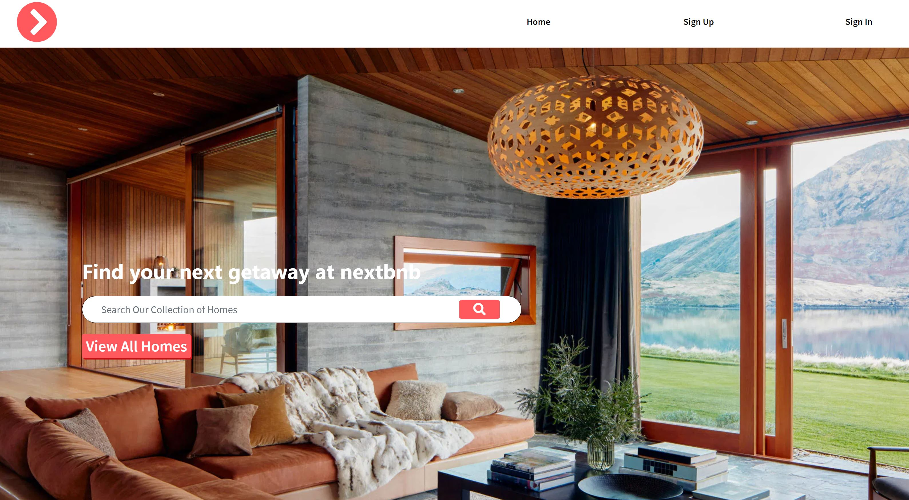

# NextBnb - API

This application allows users to view properties and manage bookings on those
properties as they plan their next travel adventure!

## Important Links

- [NextBnb Client](https://gambinos14.github.io/nextbnb-client/#/)
- [NextBnb Client Repo](https://github.com/Gambinos14/nextbnb-client)
- [NextBnb Django API](https://nextbnb-api.herokuapp.com/)

## Homepage View



## Planning Story

To build the api I first had to outline the relationships between my resources so
that I could make sure I'd have the necessary information to build out the front
end. I decided to build complete CRUD routes on the bookings resource, while only
building out GET routes for my house model.

Between the house model and booking model, I was able to obtain all the information
I would need on the client side to accurately display the details of a users'
booking reservation. The api can easily be built out to handle full CRUD actions
on the house model as well as the image model.

I thought one of the most challenging aspects of building out the Djano API was
choosing the right data model fields for my booking model. Initially, I tried using
a DateRange field which wasn't correctly handling the data I was sending it, so
eventually I settled on a DateField model with two keys on my model for a start
date and end date for each booking.

There were a few other challenges associated with having to override the queryset
attribute on a few rest-framework class-based views, but in the end I was able
to overcome those by giving queryset the value of an empty string.

### User Stories

* As an unregistered user, I would like to sign up with email and password.
* As a registered user, I would like to sign in with email and password.
* As a signed in user, I would like to change password.
* As a signed in user, I would like to sign out.
* As a signed in user, I would like to make a reservation at my favorite property.
* As a signed in user, I would like to be able to update my reservation.
* As a signed in user, I would like to cancel a reservation.
* As a signed in user, I would like to see all my reservations.
* As a signed in user, I would like to view individual reservation details

### Preparation Steps for Installation

1. Fork and clone this repository.
2. Move into the new project and ```git init```.
3. Create and checkout to a new branch for your work.
4. Open the repository in Atom with atom .
5. Create a ```.env``` file
6. In the .env file add a key ```ENV``` with the value ```development``` exactly.
7. Run ```pipenv shell``` to start up your virtual environment.
8. Run ```pipenv install``` to install dependencies.
9. Create a psql database for your project
    a. Type ```psql``` to get into interactive shell.
    b. Run ```CREATE DATABASE "project_db_name"```; where ```project_db_name``` is the name you want for your database.
10. Add the database name to the ```.env file``` using the key ```DB_NAME_DEV```.
11. Replace all instances of ```nextbnb-api``` with a new name. This includes the folder included in this repository.
12. Generate a secret key using [this tool](https://djecrety.ir/) and add it to the ```.env``` file using the key ```SECRET```.
13. Run ```python manage.py makemigrations```.
14. Finally, run ```python manage.py migrate```.
15. Start up the server with ```python manage.py runserver```.

### API Routes

Auth Routes:

POST sign-up/
POST sign-in/
DELETE sign-out/
POST change-pw/

House Routes:

GET houses/
GET houses/:slug/
GET houses/featured/:slug/
GET houses/id/:pk/

Booking Routes:

GET bookings/
POST bookings/
GET bookings/:pk/
PATCH bookings/:pk/
DELETE bookings/:pk/

### Technologies Used

- Python
- Django
- SQL
- Postgres
- Heroku

### Unsolved Problems/Future Updates

- Would like to continue building out the views for houses so that I can create
and update houses from the client site.
- Would like to eventually add a comment model so that users can add comments
on the houses.
- Would like to move some of the booking dates filtering logic to the backend, so
that I can return less data to the client.

#### Wireframe and ERD

- [Wireframe and ERDs ](https://docs.google.com/document/d/1Pk_ML21nfQIxZaxbK4QNUWwwAYiqOJhJ7Ier5KqV4WY/edit?usp=sharing)
